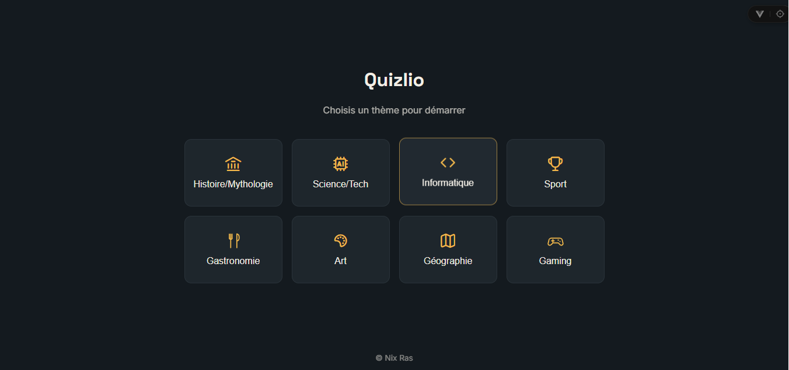
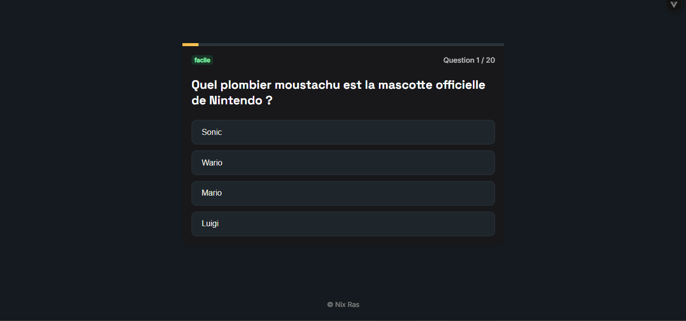

# 🧠 Quizlio

Quizlio est une application de quiz interactive développée avec **Vue 3**, où tu choisis un thème et génères un quiz personnalisé pour tester tes connaissances.

  

## 📸 Aperçu

<p align="center">
  
  
</p>

## ✨ Fonctionnalités

- 🎯 Sélection de thème (Histoire/Mythologie, Science/Tech, Informatique, Sport, Gastronomie, Art, Géographie, Gaming)
- ❓ Quiz de 20 questions générées dynamiquement, avec plusieurs niveaux de difficulté
- 📊 Suivi de la progression en temps réel (barre de progression, compteur de questions)
- ✅ Feedback visuel immédiat (bonne / mauvaise réponse)
- 🏆 Écran de score final avec possibilité de rejouer
- 🌙 Interface en thème sombre, responsive

## 🛠️ Stack technique

| Techno | Usage |
|---|---|
| [Vue 3](https://vuejs.org/) | Framework front-end (Composition API + `<script setup>`) |
| [Vite](https://vitejs.dev/) | Build tool / dev server |
| [PrimeVue](https://primevue.org/) | Librairie de composants UI (Card, Tag, ProgressSpinner...) |
| [PrimeIcons](https://primevue.org/icons/) | Librairie d'icônes |
| [Tailwind CSS](https://tailwindcss.com/) | Utilitaires CSS |

## 🚀 Installation

```bash
# Cloner le dépôt
git clone https://github.com/nilainaras/quizlio.git
cd quizlio

# Installer les dépendances
npm install

# Lancer le serveur de développement
npm run dev
```

L'application sera disponible sur `http://localhost:5173`.

### Build de production

```bash
npm run build
npm run preview
```

## 📁 Structure du projet

```
quizlio/
├── docs/
│   └── screenshots/
│       ├── theme-menu.png
│       └── quiz-question.png
├── public/
│   └── favicon.svg
├── src/
│   ├── components/
│   │   ├── ThemeMenu.vue      # Écran de sélection de thème
│   │   ├── QuizQuestion.vue   # Écran de question
│   │   └── ScoreScreen.vue    # Écran de résultat final
│   ├── services/
│   │   └── gemini.js          # Génération des questions
│   ├── App.vue
│   ├── main.js
│   └── style.css
├── index.html
└── package.json
```

## 📄 Licence

Ce projet est open source et distribué sous licence [MIT](./LICENSE).

---
